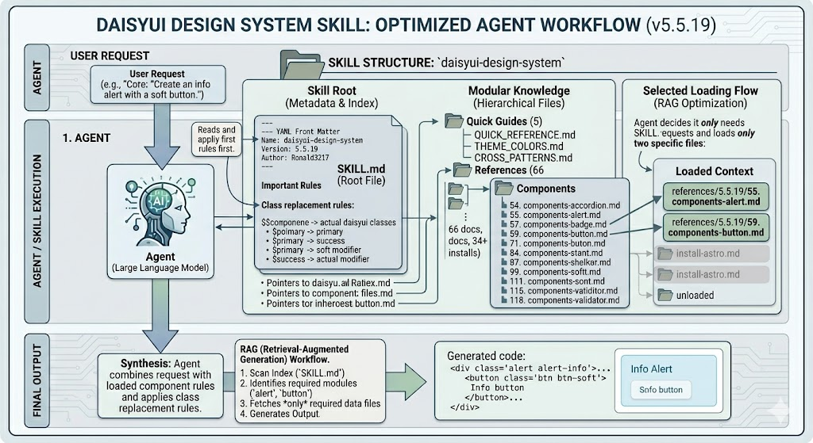

# daisyUI Design System Skill

[](https://daisyui.com/)
[](LICENSE)
[](https://tailwindcss.com/)

A comprehensive design system skill for **daisyUI**, a component library for Tailwind CSS. This skill provides instant access to 66 components, 34+ framework installation guides, and complete documentation references for building modern UI interfaces.



---

## Features

- **66 Components** - Complete reference for all daisyUI components
- **34+ Framework Guides** - Installation instructions for React, Vue, Next.js, Nuxt, Svelte, Angular, and more
- **Quick Reference** - Size classes, color variants, breakpoints, and utilities
- **Theme System** - CSS variables, color utilities, and 29 built-in themes
- **Cross-Patterns** - Form layouts, modals, navbars, cards, and more
- **Page Templates** - Login, dashboard, settings, blog templates
- **Troubleshooting** - Common issues and debugging tips

---

## Quick Guides

| File                                                                 | Description                                               |
| -------------------------------------------------------------------- | --------------------------------------------------------- |
| [QUICK_REFERENCE.md](daisyui-design-system-skill/QUICK_REFERENCE.md) | Sizes, colors, breakpoints, utilities                     |
| [THEME_COLORS.md](daisyui-design-system-skill/THEME_COLORS.md)       | Theme system, CSS variables, color utilities              |
| [CROSS_PATTERNS.md](daisyui-design-system-skill/CROSS_PATTERNS.md)   | Component combinations: forms, modals, navbars, cards     |
| [TEMPLATES.md](daisyui-design-system-skill/TEMPLATES.md)             | Complete page templates: login, dashboard, settings, blog |
| [TROUBLESHOOTING.md](daisyui-design-system-skill/TROUBLESHOOTING.md) | Common issues, debugging, tips & best practices           |

---

## Available Components

Accordion, Alert, Avatar, Badge, Breadcrumbs, Button, Calendar, Card, Carousel, Chat, Checkbox, Collapse, Countdown, Diff, Divider, Dock, Drawer, Dropdown, FAB, Fieldset, File Input, Filter, Footer, Hero, Hover 3D, Hover Gallery, Indicator, Input, Join, Kbd, Label, Link, List, Loading, Mask, Menu, Mockup Browser/Code/Phone/Window, Modal, Navbar, Pagination, Progress, Radial Progress, Radio, Range, Rating, Select, Skeleton, Stack, Stat, Status, Steps, Swap, Tab, Table, Text Rotate, Textarea, Theme Controller, Timeline, Toast, Toggle, Tooltip, Validator

---

## How to Use

This is a skill designed to work with **opencode** (an AI coding assistant). When you need to build UI with daisyUI:

1. **Start a conversation** with opencode
2. **Describe your UI need** - e.g., "Create a login page with form validation"
3. **The skill provides** - Component classes, proper structure, responsive patterns

### Example Usage

**Input:**

> Create a responsive navbar with logo, navigation links, and a search bar

**Output includes:**

- Navbar component structure
- Proper responsive classes
- Search input with icons

### Class Pattern Replacement

When the skill shows placeholders like `$$componente`, replace them with actual daisyUI classes:

```
$$button $$button-$$variant  →  btn btn-primary
$$input $$input-$$variant    →  input input-primary
$$badge $$badge-$$variant     →  badge badge-primary
```

---

## Color Variants

| Variant     | Description      |
| ----------- | ---------------- |
| `primary`   | Main brand color |
| `secondary` | Secondary brand  |
| `accent`    | Accent color     |
| `neutral`   | Dark neutral     |
| `info`      | Info messages    |
| `success`   | Success messages |
| `warning`   | Warning messages |
| `error`     | Error messages   |

### Style Modifiers

| Modifier  | Description            |
| --------- | ---------------------- |
| `outline` | Outline style          |
| `soft`    | Soft/filled background |
| `ghost`   | Transparent background |
| `dash`    | Dashed outline         |

---

## Built-in Themes

light, dark, cupcake, bumblebee, emerald, corporate, synthwave, retro, cyberpunk, valentine, halloween, garden, forest, aqua, lofi, pastel, fantasy, wireframe, black, luxury, dracula, cmyk, autumn, business, acid, lemonade, night, coffee, winter

---

## Documentation Structure

```
daisyui-design-system-skill/
├── SKILL.md                    # Main skill file
├── QUICK_REFERENCE.md          # Quick reference tables
├── THEME_COLORS.md             # Theme & color system
├── CROSS_PATTERNS.md           # Component combinations
├── TEMPLATES.md                # Page templates
├── TROUBLESHOOTING.md          # Common issues
└── references/5.5.19/
    ├── components-*.md        # 66 component references
    ├── docs-*.md               # Documentation
    └── install-*.md            # 34+ framework installations
```

---

## Resources

- [daisyUI Official Docs](https://daisyui.com/)
- [Tailwind CSS](https://tailwindcss.com/)
- [GitHub](https://github.com/saadeghi/daisyui)

---

## License

MIT License - See [LICENSE](LICENSE) for details.

---

**Version:** 5.5.19  
**Author:** Ronald3217  
**Tags:** tailwind, css, component-library, ui-design-system, daisyui
